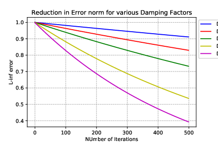
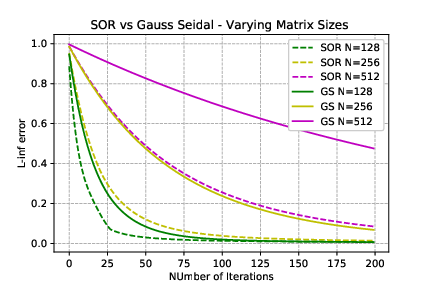
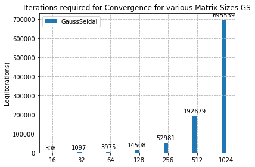

# Multi Grid Methods - A Study on Convergence of Different Eigen modes

## Jacobi Iteration with Varying Eigen Mode as Initial Guess 
==========================================================

The below Plot reveals how the residual reduces at varying rates for a
Jacobi Iteration when the Initial guess of the iteration has a
combination of varying eigen modes.

### Inference 

The sudden reduction in the solution at the start is due to the presence
of Higher frequency modes in the Solution and as the Iteration increases
the lower frequency modes dominate leading to reduced decrease in the
Error norm.

## Damped vs Normal Jacobi - Damping Factor 0.666 - Eigen Mode = 1 
================================================================

The Below plot shows the difference in reduction of error norm between
the normal Jacobi and the Damped Jacobi with the Eigen Mode as 1 for
Varying Matrix Sizes

### Inference

The Error Norm Decreases faster for the normal Jacobi Iterations
compared with the Damped Jacobi Iterations However, The
Magnitude(variation) of reduction of error norm for different Matrix
sizes decreases as the Matrix size increases.

## Damped vs Normal Jacobi - Damping Factor 0.666 - Matrix Size = 256
===================================================================

The Below plot shows the difference in reduction of error norm between
the normal Jacobi and the Damped Jacobi with the matrix size as 256 for
varying Eigen Modes of Initial Guess

### Inference 
The Error Norm Decreases faster for the normal Jacobi Iterations
compared with the Damped Jacobi Iterations However, The
Magnitude(variation) of reduction of error norm for different Eigen
Modes decreases as the Eigen Mode size increases.

## Damped Jacobi for various damping factors 
==========================================

The Below plot shows the difference in reduction of error norm between
the for the damped Jacobi Iterations for varying Damping factor values.

## SOR - for Varying Relaxation Values 
===================================

The Below plot shows the difference in reduction of error norm between
the for the damped Gauss Seidel Iterations for varying Relaxing factor
values.The Matrix size used is 512 and the Eigen Mode is 10.

### Inference 

The Error Norm is greatly reduced , when the Over relaxation Value gets
closer to 2 However As shown in figure 6, When We approach very close to
2, like 1.999 , then the Method Diverges.

## SOR - for varying Matrix Sizes - Fixed Relaxation Parameter - 1.9 
=================================================================

The Below plot shows the difference in reduction of error norm between
the for the damped Gauss Seidel Iterations for varying Matrix sizes.The
Relaxation Parameter used is 1.9 the Eigen Mode is 10.

### Inference 

When the Matrix Size is Smaller , then as the relaxation Value
approaches 2, then the convergence becomes oscillatory . For lower
Relaxation values like 1.6 , the error reduction will be shown as below

## SOR vs Gauss Seidel - Varying Matrix Sizes - reduction in Error norm 
====================================================================

The Below plot shows the difference in reduction of error norm between
the Gauss Seidel and damped Gauss Seidel Iterations for varying Matrix
sizes.The Relaxation Parameter used is 1.6 the Eigen Mode is 10.

### Inference 

The Relaxation Parameter in SOR increases the convergence of the System
, which increases with the increase in Matrix sizes

## SOR vs Gauss Seidel - Varying Matrix Sizes - Iteration Count
============================================================

The Below plot shows the number of iterations required for Gauss Seidel
to converge to an error norm of 0.000001. The Eigen Mode is fixed as 6.

## SOR vs Gauss Seidel - Varying Matrix Sizes - Iteration Count 
============================================================

The Below plot shows the difference in reduction of error norm between
the Gauss Seidel and SOR Iterations for varying Matrix sizes. the Eigen
Mode is 6.

### Inference

The Relaxation Parameter in SOR increases the rate of convergence of the
system which becomes significant at the larger matrix sizes

| **Size** | **Gauss Seidel** | **Relaxation : 1.2** | **Relaxation : 1.6** | **Relaxation : 1.8** | **Relaxation : 1.9** |
|----------|------------------|----------------------|----------------------|----------------------|----------------------|
| 16       | 308              | 212                  | 78                   | 68                   | 134                  |
| 32       | 1097             | 760                  | 305                  | 124                  | 140                  |
| 64       | 3975             | 2764                 | 1136                 | 528                  | 217                  |
| 128      | 14508            | 10127                | 4206                 | 2008                 | 986                  |
| 256      | 52981            | 37129                | 15560                | 7507                 | 3791                 |
| 512      | 192679           | 135659               | 57407                | 27906                | 14243                |
| 1024     | 695539           | 492467               | 210774               | 103260               | 53077                |
